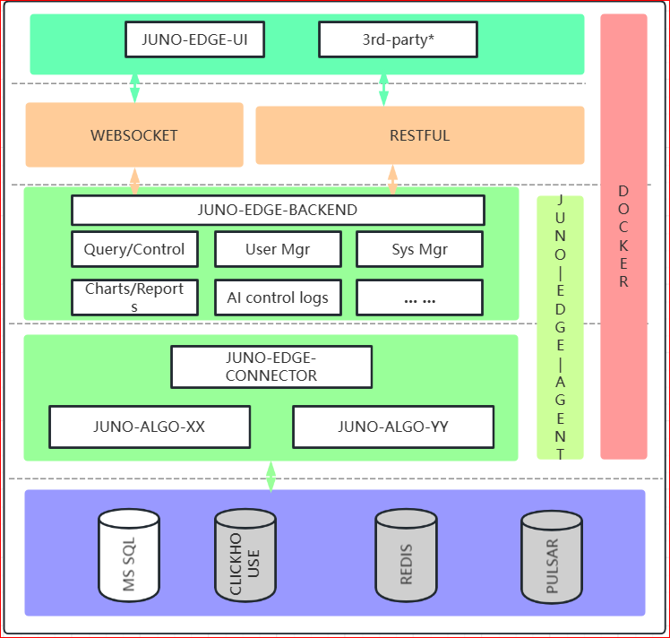
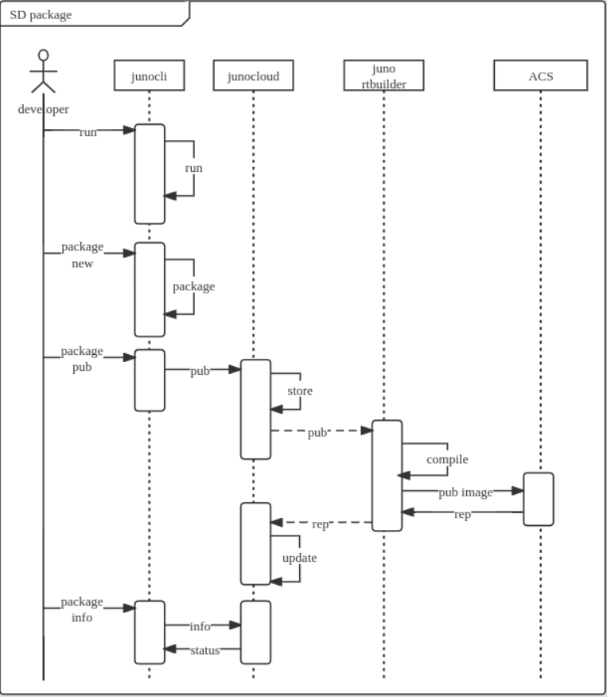
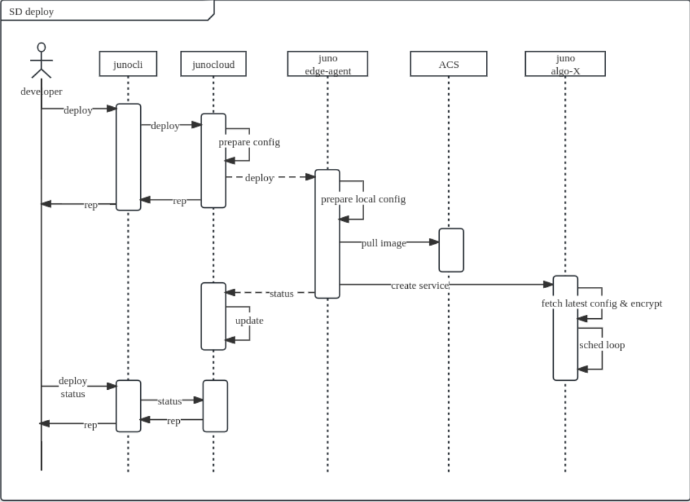
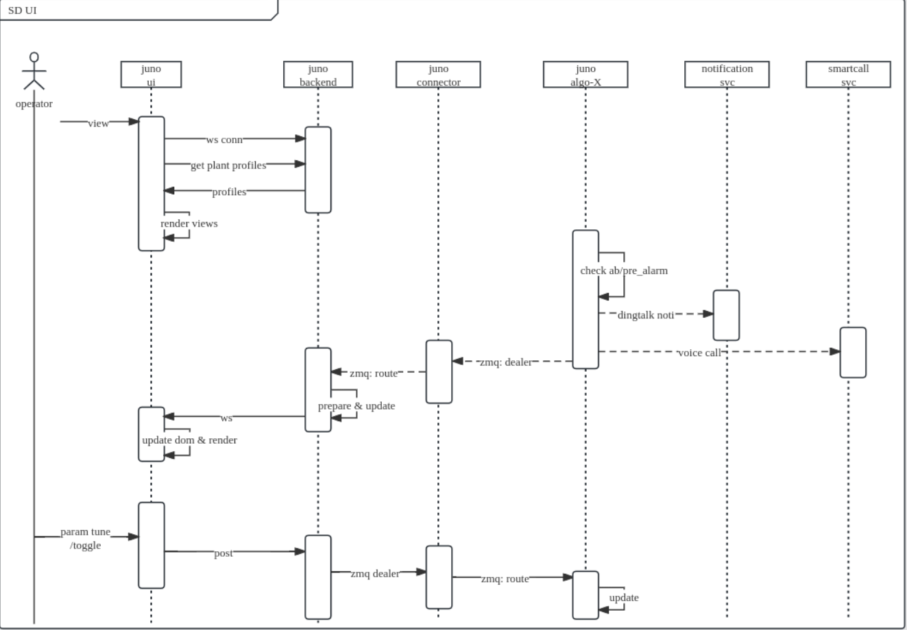
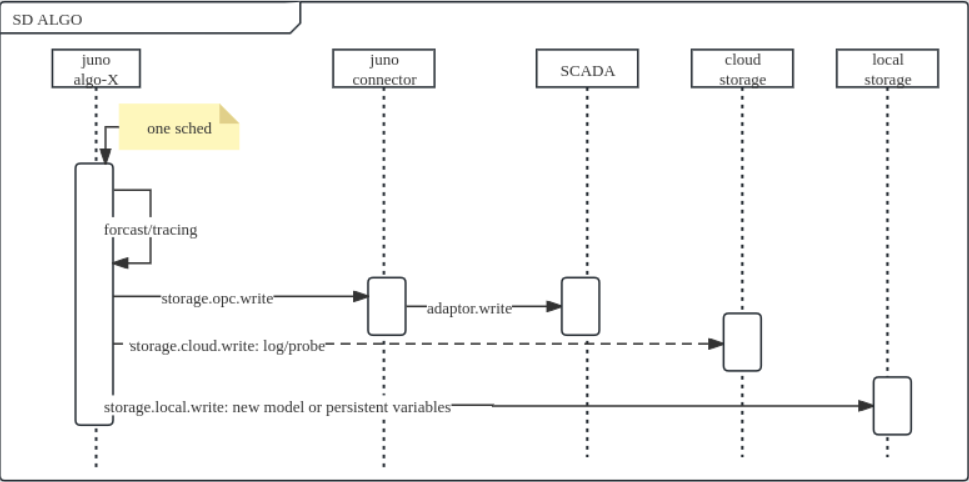

## 背景

当前AI决策运维控制系统在AI算法的工程化对接, 部署, 调参, 回滚等方面存在效率问题, 需要依赖人工在每一个环节对接, 当项目数量和AI部署模块多的时候(&gt;=4个项目)处理算法工程化开发, 部署, 调整, 观察等一系列问题处理可能因效率问题难以收敛.

JunoPlatform在此背景下被提上日程.

## 需要解决的问题

1.  算法和平台在AI算法的输入输出层面作标准化
2.  提供一整套自动打包, 部署, 调参和回滚的机制, 并对算法进行仓库化管理
3.  提供通用的上报云端数据机制
4.  提供通用的边缘侧本地存储机制

## 总体设计

junoplatform 是一个伞概念, 包括:

1.junoplatform-cloud

该子系统为云端中心子系统, 负责沟通junocli, junoplatform-runtime, junoplatform-edge-agent, junoplatform-rtbuilder, junoplatform-connector

2\. junoplatform-runtime

以python pip库形式提供了算法基础运行时, 标准化了算法的输入输出. 并提供了受控组件用以接收云端下发的调控命令

3\. junocli

开发人员交互命令行工具, 提供了算法打包, 编译, 发布, 部署, 回滚, 和查询等命令行交互接口

4\. junoplatform-rtbuilder

算法打包编译子系统.

5.junoplatform-edge-agent

边缘侧代理子系统, 负责边缘侧部署的算法包运行时与其他子系统的通信

6.junoplatform-connector

边缘侧现场工业控制接口子系统. 封装了工业控制接口提供给部署到边缘侧的算法包调用

7\. B端用户交互子系统

提供前后端给现场人员进行调控, 监控

   

