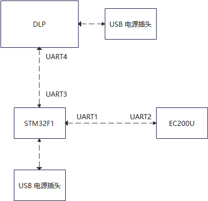

### 实现原理

1 修改DLP固件代码, 启用UART4 DEBUG\_PRINT功能, 刷DLP固件

2 实现STM32 UART3 收取 DLP UART4的DEBUG\_PRINT

3 实现STM32 UART1 的4G模块通信, 和UART3转发

4 DLP的DEBUG\_PRINT会在内部逻辑处理失败发生时给出错误信息, 转发到云端

  

### 硬件组成

<figure class="image op-uc-figure">

</figure>

  

### 使用

1 刷DLP固件包

附件[NIRscanNano.bin](https://op.shuhan-juno.com/api/v3/attachments/159/content)

2\. 刷STM32F103C8T6 固件包

附件[tftm096.bin](https://op.shuhan-juno.com/api/v3/attachments/161/content)

3\. 接线方式

3.1 DLP extension pack的PIN2接STM32F103的GND, PIN3接STM32F103的PB10, PIN4接STM32的PB11

3.2 EC200U的TX接STM32F103的PA10, EC200U的RX接STM32F103的PA9, GND接STM32F103的GND, 5V接STM32的5V

3.3 STM32通过USB上电

另: STM32的固件中还包括了一块迷你显示屏的驱动, 用以驱动显示屏显示微控制器的内部调试信息. 不接改迷你显示屏不会影响到功能.