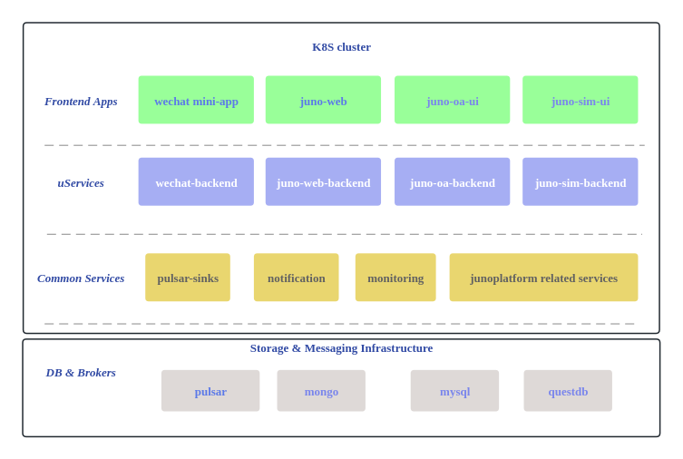

陆宗宝 2023/11/01 draft

本文档梳理了当前的数翰云端产品， 系统及可预见的下年度新老系统的开发和规划

## juno-sim

状态： 规划中

目标客户： 投资人，技术研究人员，运营，第三方研发机构或单位

优先级： 中

描述： 通用算法模拟平台. 主要目的是交互式直观展示选定的工艺， 算法，输入和超参设定下， 算法输出

最终版本：

1.  工艺组件（风机， 阀门， 管道， 沉降池等）等可从工艺设备库中选取绘制到3D动画场景中， 并改变参数和形状， 从而绘制工艺流程
2.  从算法库中选取SISO, MIMO等通用或定制算法， 添加到场景的工艺环节， 并连接输入输出到对应的工艺设备
3.  配置算法超参， 执行模拟， 并可以反复迭代此步骤
4.  执行模拟后可以在场景中观测到实时模拟数值在对应设备上
5.  展示可能的因果关系和规律
6.  每次模拟执行的结果可以以报表或图表的形式展示和下载

备注：

1.  初始版本和中间过度版本可能没有对应的3D动画场景。
2.  算法库由算法人员上传
3.  算法库有标准型可以遵循， 确保模拟执行，调参本身的通用性。

资源需求：

1.  ECS虚拟机实例（8核，16G）\*5, 大概10万元
2.  3D建模与集成
3.  GPU资源， 费用待评估

## juno-web

状态： 已部署， 完善迭代中

目标客户： 数翰内部人员

优先级： 中

描述： juno-web产品可以理解成云端大屏， 汇聚了各水厂的运行数据及算法定制的报表。 是数字孪生计划的一部分。 后续可能整合到juno-sim中

##   

## juno-oa

状态： 规划中

目标客户： AI运维决策控制系统落地相关方， 包括 算法， 运营， 运行方

优先级： 高

描述：

1.  本系统的根本目标是通过规范化客户对算法的输入输出要求， 算法运营状态，消除沟通过程中的信息延迟和不一致，使参与各方有共同的trust source从而保持在同一个信息平面。
2.  junoplatform 二期开发：
    1.  junoplatform的云端前端内容可以集成到OA中， 包括算法包列表， 部署状态和部署审批系统：
    2.  部署审批系统是指，算法人员的部署命令本质上生成请求单， 只有特定人员审批通过后， 部署操作才会真正执行。
    3.  junoplatform 算法包的混淆， 编译和加密

## 微信小程序

状态： 已部署，支持多水厂接入（可能有针对性定制开发）

目标客户： 水厂运行或管理人员，

优先级： 低

描述： 微信小程序是云端数据汇聚基础设施的一个小应用， 当前只负责展示对应水厂的核心运行数据

