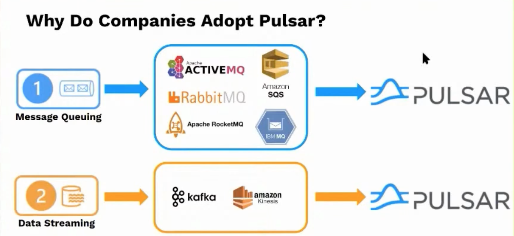
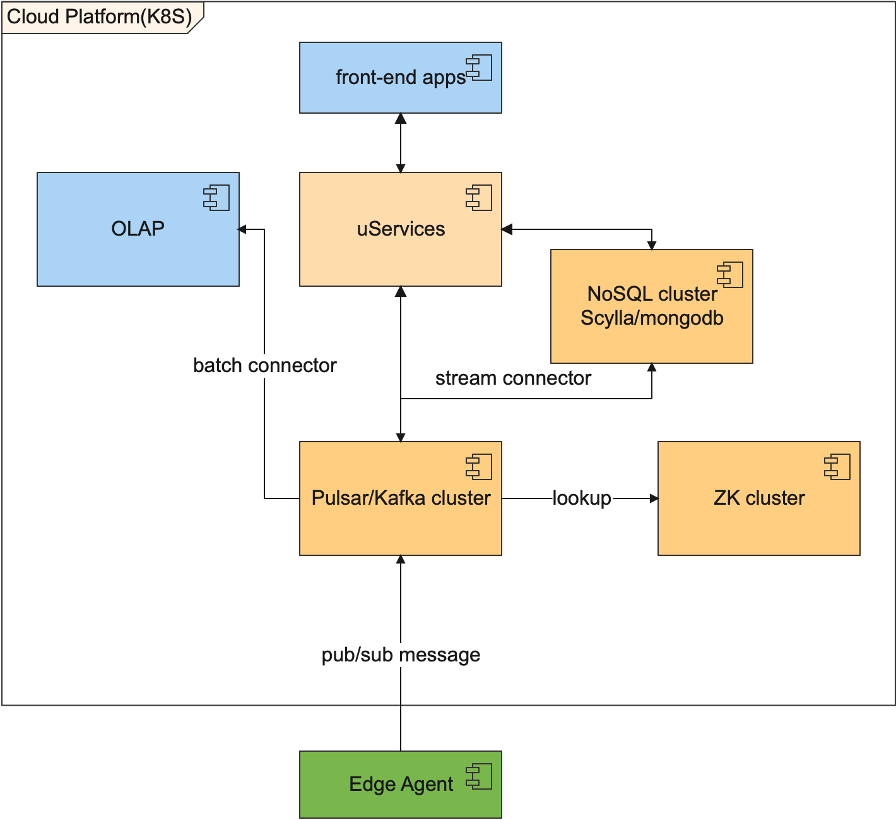

## 服务编排与治理: K8S

[https://kubernetes.io/zh-cn/docs/home/](https://kubernetes.io/zh-cn/docs/home/)

## 数据传输与分发: Apache Pulsar1

https://github.com/apache/pulsar

https://pulsar.apache.org/case-studies/

```text
Apache Pulsar is a Cloud-Native Messaging 
and Event-Streaming Platform

Key features:
Cloud-native: Pulsar is designed to run in Elastic Cloud environments, across a variety of hardware configurations.
Distributed: Pulsar is horizontally scalable, with clients and data segmented across multiple nodes with no single point of failure.
Messaging: Pulsar supports the publish-subscribe pattern and other common messaging paradigms.
Streaming: Pulsar supports low-latency and long-term event capture, storage, and processing.
```

存储与计算分层(与kafka相比), 支持Function函数服务(serverless), websocket等

### 适用场景(解决了什么问题)

将消息队列与数据流处理的复杂开源技术栈简化



## 实时数据存储: Scylla

https://github.com/scylladb/scylladb

https://www.scylladb.com/open-source-nosql-database/

https://www.scylladb.com/scylla-vs-cassandra/

Cassandra的后继者,

完全兼容cassandra (QHL, 接口, 驱动等)

2X ~ 8X性能提升,

share-nothing高性能无锁和无垃圾回收设计(C++开发, 非基于JVM),

运维管理更简单

等等

### 为什么没有沿用ClickHouse

ClickHouse位于下游靠近App的地方,  其不适合实时数据的插入, 适用于批量百万级记录的一次性导入后进行聚合分析.

我们云平台要实时接入多个水厂的运行数据, 所以需要高性能的NoSQL存储. 可选型有: Cassandra, MongoDB, ScyllaDB.

ScyllaDB的诸多优势作为目前优先选项.

## 编程语言和框架

### python: fastapi

https://fastapi.tiangolo.com/zh/

### golang: gin

https://github.com/gin-gonic/gin

## C++: 无特定

