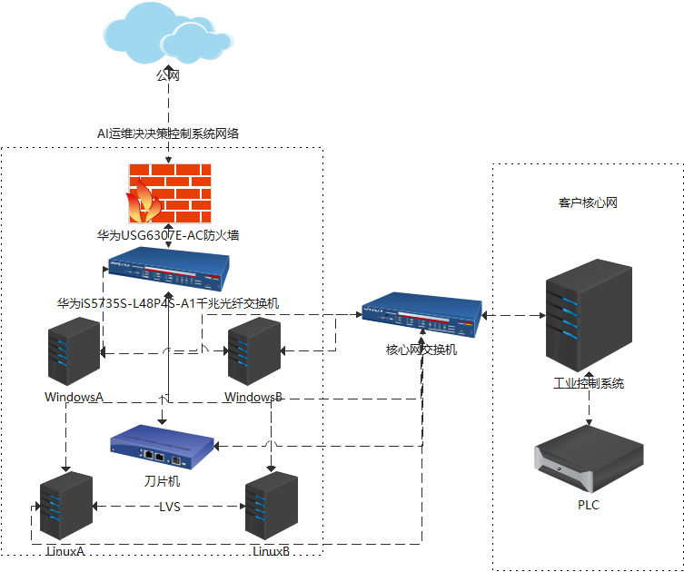

## 发货前准备工作

### 1 硬件采购和确认

<figure class="table op-uc-figure_align-center op-uc-figure" style="width:836pt;"><table class="op-uc-table"><tbody><tr class="op-uc-table--row"><td class="op-uc-p op-uc-table--cell" style="height:22.9pt;width:37pt;">序号</td><td class="op-uc-p op-uc-table--cell" style="border-left-style:none;width:131pt;">设备名称</td><td class="op-uc-p op-uc-table--cell" style="border-left-style:none;width:59pt;">采购数量</td><td class="op-uc-p op-uc-table--cell" style="border-left-style:none;width:50pt;">单位</td><td class="op-uc-p op-uc-table--cell" style="border-left-style:none;width:397pt;">性能参数</td><td class="op-uc-p op-uc-table--cell" style="border-left-style:none;width:62pt;">品牌</td><td class="op-uc-p op-uc-table--cell" style="border-left-style:none;width:100pt;">备注</td></tr><tr class="op-uc-table--row"><td class="op-uc-p op-uc-table--cell" style="border-top-style:none;height:22.9pt;width:37pt;">1</td><td class="op-uc-p op-uc-table--cell" style="border-left-style:none;border-top-style:none;width:131pt;">机柜</td><td class="op-uc-p op-uc-table--cell" style="border-left-style:none;border-top-style:none;width:59pt;">　</td><td class="op-uc-p op-uc-table--cell" style="border-left-style:none;border-top-style:none;width:50pt;"></td><td class="op-uc-p op-uc-table--cell" style="border-left-style:none;border-top-style:none;width:397pt;">　</td><td class="op-uc-p op-uc-table--cell" style="border-left-style:none;border-top-style:none;width:62pt;">　</td><td class="op-uc-p op-uc-table--cell" style="border-left-style:none;border-top-style:none;width:100pt;">　</td></tr><tr class="op-uc-table--row"><td class="op-uc-p op-uc-table--cell" style="border-top-style:none;height:45.0pt;width:37pt;">1.1</td><td class="op-uc-p op-uc-table--cell" style="border-left-style:none;border-top-style:none;width:131pt;">42U机柜+(含机柜挡板)</td><td class="op-uc-p op-uc-table--cell" style="border-left-style:none;border-top-style:none;">1</td><td class="op-uc-p op-uc-table--cell" style="border-left-style:none;border-top-style:none;width:50pt;">套</td><td class="op-uc-p op-uc-table--cell" style="border-left-style:none;border-top-style:none;width:397pt;">尺寸：800*1000*2000，定制LOGO标识（激光或丝网印），前玻璃门，标准19英寸；两组4只温控单元风扇</td><td class="op-uc-p op-uc-table--cell" style="border-left-style:none;border-top-style:none;width:62pt;">数翰定制</td><td class="op-uc-p op-uc-table--cell" style="border-left-style:none;border-top-style:none;width:100pt;">1-6U（2U,8个，4U,4个）</td></tr><tr class="op-uc-table--row"><td class="op-uc-p op-uc-table--cell" style="border-top-style:none;height:22.9pt;width:37pt;">2</td><td class="op-uc-p op-uc-table--cell" style="border-left-style:none;border-top-style:none;width:131pt;">显示器</td><td class="op-uc-p op-uc-table--cell" style="border-left-style:none;border-top-style:none;width:59pt;">　</td><td class="op-uc-p op-uc-table--cell" style="border-left-style:none;border-top-style:none;width:50pt;">　</td><td class="op-uc-p op-uc-table--cell" style="border-left-style:none;border-top-style:none;width:397pt;">　</td><td class="op-uc-p op-uc-table--cell" style="border-left-style:none;border-top-style:none;">　</td><td class="op-uc-p op-uc-table--cell" style="border-left-style:none;border-top-style:none;">　</td></tr><tr class="op-uc-table--row"><td class="op-uc-p op-uc-table--cell" style="border-top-style:none;height:22.9pt;width:37pt;">2.1</td><td class="op-uc-p op-uc-table--cell" style="border-left-style:none;border-top-style:none;">服务器KVM</td><td class="op-uc-p op-uc-table--cell" style="border-left-style:none;border-top-style:none;width:59pt;">1</td><td class="op-uc-p op-uc-table--cell" style="border-left-style:none;border-top-style:none;width:50pt;">台</td><td class="op-uc-p op-uc-table--cell" style="border-left-style:none;border-top-style:none;width:397pt;">8口17英寸 4合一套件</td><td class="op-uc-p op-uc-table--cell" style="border-left-style:none;border-top-style:none;">　</td><td class="op-uc-p op-uc-table--cell" style="border-left-style:none;border-top-style:none;width:100pt;">　</td></tr><tr class="op-uc-table--row"><td class="op-uc-p op-uc-table--cell" style="border-top-style:none;height:22.9pt;width:37pt;">2.2</td><td class="op-uc-p op-uc-table--cell" style="border-left-style:none;border-top-style:none;">显示器</td><td class="op-uc-p op-uc-table--cell" style="border-left-style:none;border-top-style:none;width:59pt;">1</td><td class="op-uc-p op-uc-table--cell" style="border-left-style:none;border-top-style:none;width:50pt;">台</td><td class="op-uc-p op-uc-table--cell" style="border-left-style:none;border-top-style:none;width:397pt;">27英寸&nbsp; &nbsp;2K</td><td class="op-uc-p op-uc-table--cell" style="border-left-style:none;border-top-style:none;">飞利浦</td><td class="op-uc-p op-uc-table--cell" style="border-left-style:none;border-top-style:none;width:100pt;">　</td></tr><tr class="op-uc-table--row"><td class="op-uc-p op-uc-table--cell" style="border-top-style:none;height:22.9pt;width:37pt;">3</td><td class="op-uc-p op-uc-table--cell" style="border-left-style:none;border-top-style:none;width:131pt;">服务器</td><td class="op-uc-p op-uc-table--cell" style="border-left-style:none;border-top-style:none;width:59pt;">　</td><td class="op-uc-p op-uc-table--cell" style="border-left-style:none;border-top-style:none;width:50pt;">　</td><td class="op-uc-p op-uc-table--cell" style="border-left-style:none;border-top-style:none;width:397pt;">　</td><td class="op-uc-p op-uc-table--cell" style="border-left-style:none;border-top-style:none;">　</td><td class="op-uc-p op-uc-table--cell" style="border-left-style:none;border-top-style:none;width:100pt;">　</td></tr><tr class="op-uc-table--row"><td class="op-uc-p op-uc-table--cell" style="border-top-style:none;height:44.45pt;width:37pt;">3.1</td><td class="op-uc-p op-uc-table--cell" style="border-left-style:none;border-top-style:none;">机架式服务器</td><td class="op-uc-p op-uc-table--cell" style="border-left-style:none;border-top-style:none;width:59pt;">1</td><td class="op-uc-p op-uc-table--cell" style="border-left-style:none;border-top-style:none;width:50pt;">套</td><td class="op-uc-p op-uc-table--cell" style="border-left-style:none;border-top-style:none;width:397pt;">至强® E-2378 2.6GHz, 8M&nbsp;缓存, 8C/16T, Turbo (65W), 3200 MT/s，硬盘2TB*3,RADI 5</td><td class="op-uc-p op-uc-table--cell" style="border-left-style:none;border-top-style:none;width:62pt;">DELL</td><td class="op-uc-p op-uc-table--cell" style="border-left-style:none;border-top-style:none;width:100pt;">　</td></tr><tr class="op-uc-table--row"><td class="op-uc-p op-uc-table--cell" style="border-top-style:none;height:22.9pt;width:37pt;">3.2</td><td class="op-uc-p op-uc-table--cell" style="border-left-style:none;border-top-style:none;">塔式服务器</td><td class="op-uc-p op-uc-table--cell" style="border-left-style:none;border-top-style:none;width:59pt;">4</td><td class="op-uc-p op-uc-table--cell" style="border-left-style:none;border-top-style:none;width:50pt;">套</td><td class="op-uc-p op-uc-table--cell" style="border-left-style:none;border-top-style:none;width:397pt;">　</td><td class="op-uc-p op-uc-table--cell" style="border-left-style:none;border-top-style:none;width:62pt;">数翰定制</td><td class="op-uc-p op-uc-table--cell" style="border-left-style:none;border-top-style:none;width:100pt;">　</td></tr><tr class="op-uc-table--row"><td class="op-uc-p op-uc-table--cell" style="border-top-style:none;height:22.9pt;width:37pt;">3.2.1</td><td class="op-uc-p op-uc-table--cell" style="border-left-style:none;border-top-style:none;">主板</td><td class="op-uc-p op-uc-table--cell" style="border-left-style:none;border-top-style:none;width:59pt;">4</td><td class="op-uc-p op-uc-table--cell" style="border-left-style:none;border-top-style:none;width:50pt;">块</td><td class="op-uc-p op-uc-table--cell" style="border-left-style:none;border-top-style:none;width:397pt;">MS-iCraft Z790 WIFI D5</td><td class="op-uc-p op-uc-table--cell" style="border-left-style:none;border-top-style:none;">铭瑄</td><td class="op-uc-p op-uc-table--cell" style="border-left-style:none;border-top-style:none;width:100pt;">　</td></tr><tr class="op-uc-table--row"><td class="op-uc-p op-uc-table--cell" style="border-top-style:none;height:22.9pt;width:37pt;">3.2.2</td><td class="op-uc-p op-uc-table--cell" style="border-left-style:none;border-top-style:none;">机箱配置</td><td class="op-uc-p op-uc-table--cell" style="border-left-style:none;border-top-style:none;width:59pt;">4</td><td class="op-uc-p op-uc-table--cell" style="border-left-style:none;border-top-style:none;width:50pt;">个</td><td class="op-uc-p op-uc-table--cell" style="border-left-style:none;border-top-style:none;width:397pt;">IPC-3000 工业电脑机箱 双开门工控机箱 工业控制 ATX主板</td><td class="op-uc-p op-uc-table--cell" style="border-left-style:none;border-top-style:none;">西门子</td><td class="op-uc-p op-uc-table--cell" style="border-left-style:none;border-top-style:none;width:100pt;">　</td></tr><tr class="op-uc-table--row"><td class="op-uc-p op-uc-table--cell" style="border-top-style:none;height:22.9pt;width:37pt;">3.2.3</td><td class="op-uc-p op-uc-table--cell" style="border-left-style:none;border-top-style:none;">处理器</td><td class="op-uc-p op-uc-table--cell" style="border-left-style:none;border-top-style:none;width:59pt;">4</td><td class="op-uc-p op-uc-table--cell" style="border-left-style:none;border-top-style:none;width:50pt;">个</td><td class="op-uc-p op-uc-table--cell" style="border-left-style:none;border-top-style:none;width:397pt;">CPU 13600K&nbsp;</td><td class="op-uc-p op-uc-table--cell" style="border-left-style:none;border-top-style:none;">英特尔</td><td class="op-uc-p op-uc-table--cell" style="border-left-style:none;border-top-style:none;width:100pt;">　</td></tr><tr class="op-uc-table--row"><td class="op-uc-p op-uc-table--cell" style="border-top-style:none;height:22.9pt;width:37pt;">3.2.4</td><td class="op-uc-p op-uc-table--cell" style="border-left-style:none;border-top-style:none;">风扇</td><td class="op-uc-p op-uc-table--cell" style="border-left-style:none;border-top-style:none;width:59pt;">4</td><td class="op-uc-p op-uc-table--cell" style="border-left-style:none;border-top-style:none;width:50pt;">个</td><td class="op-uc-p op-uc-table--cell" style="border-left-style:none;border-top-style:none;width:397pt;">利民 SI-100，100mm6热管</td><td class="op-uc-p op-uc-table--cell" style="border-left-style:none;border-top-style:none;width:62pt;">利民</td><td class="op-uc-p op-uc-table--cell" style="border-left-style:none;border-top-style:none;width:100pt;">　</td></tr><tr class="op-uc-table--row"><td class="op-uc-p op-uc-table--cell" style="border-top-style:none;height:22.9pt;width:37pt;">3.2.5</td><td class="op-uc-p op-uc-table--cell" style="border-left-style:none;border-top-style:none;">内存</td><td class="op-uc-p op-uc-table--cell" style="border-left-style:none;border-top-style:none;width:59pt;">4</td><td class="op-uc-p op-uc-table--cell" style="border-left-style:none;border-top-style:none;width:50pt;">个</td><td class="op-uc-p op-uc-table--cell" style="border-left-style:none;border-top-style:none;width:397pt;">DDR5 16GB*2</td><td class="op-uc-p op-uc-table--cell" style="border-left-style:none;border-top-style:none;width:62pt;">金百达</td><td class="op-uc-p op-uc-table--cell" style="border-left-style:none;border-top-style:none;width:100pt;">　</td></tr><tr class="op-uc-table--row"><td class="op-uc-p op-uc-table--cell" style="border-top-style:none;height:22.9pt;width:37pt;">3.2.6</td><td class="op-uc-p op-uc-table--cell" style="border-left-style:none;border-top-style:none;">硬盘</td><td class="op-uc-p op-uc-table--cell" style="border-left-style:none;border-top-style:none;width:59pt;">4</td><td class="op-uc-p op-uc-table--cell" style="border-left-style:none;border-top-style:none;width:50pt;">个</td><td class="op-uc-p op-uc-table--cell" style="border-left-style:none;border-top-style:none;width:397pt;">TiPro7000 Gen4 1TB</td><td class="op-uc-p op-uc-table--cell" style="border-left-style:none;border-top-style:none;width:62pt;">致态长江</td><td class="op-uc-p op-uc-table--cell" style="border-left-style:none;border-top-style:none;width:100pt;">　</td></tr><tr class="op-uc-table--row"><td class="op-uc-p op-uc-table--cell" style="border-top-style:none;height:22.9pt;width:37pt;">3.2.7</td><td class="op-uc-p op-uc-table--cell" style="border-left-style:none;border-top-style:none;">电源</td><td class="op-uc-p op-uc-table--cell" style="border-left-style:none;border-top-style:none;width:59pt;">4</td><td class="op-uc-p op-uc-table--cell" style="border-left-style:none;border-top-style:none;width:50pt;">个</td><td class="op-uc-p op-uc-table--cell" style="border-left-style:none;border-top-style:none;width:397pt;">GX750</td><td class="op-uc-p op-uc-table--cell" style="border-left-style:none;border-top-style:none;">海韵</td><td class="op-uc-p op-uc-table--cell" style="border-left-style:none;border-top-style:none;width:100pt;">　</td></tr><tr class="op-uc-table--row"><td class="op-uc-p op-uc-table--cell" style="border-top-style:none;height:22.9pt;width:37pt;">4</td><td class="op-uc-p op-uc-table--cell" style="border-left-style:none;border-top-style:none;width:131pt;">电源</td><td class="op-uc-p op-uc-table--cell" style="border-left-style:none;border-top-style:none;width:59pt;">　</td><td class="op-uc-p op-uc-table--cell" style="border-left-style:none;border-top-style:none;width:50pt;">　</td><td class="op-uc-p op-uc-table--cell" style="border-left-style:none;border-top-style:none;width:397pt;">　</td><td class="op-uc-p op-uc-table--cell" style="border-left-style:none;border-top-style:none;">　</td><td class="op-uc-p op-uc-table--cell" style="border-left-style:none;border-top-style:none;width:100pt;">　</td></tr><tr class="op-uc-table--row"><td class="op-uc-p op-uc-table--cell" style="border-top-style:none;height:22.9pt;width:37pt;">4.1</td><td class="op-uc-p op-uc-table--cell" style="border-left-style:none;border-top-style:none;width:131pt;">UPS备用电源</td><td class="op-uc-p op-uc-table--cell" style="border-left-style:none;border-top-style:none;width:59pt;">1</td><td class="op-uc-p op-uc-table--cell" style="border-left-style:none;border-top-style:none;">台</td><td class="op-uc-p op-uc-table--cell" style="border-left-style:none;border-top-style:none;width:397pt;">3KVA/2400W（UPS2000-G-3KRTS&nbsp;）</td><td class="op-uc-p op-uc-table--cell" style="border-left-style:none;border-top-style:none;">华为</td><td class="op-uc-p op-uc-table--cell" style="border-left-style:none;border-top-style:none;width:100pt;">　</td></tr><tr class="op-uc-table--row"><td class="op-uc-p op-uc-table--cell" style="border-top-style:none;height:22.9pt;width:37pt;">5</td><td class="op-uc-p op-uc-table--cell" style="border-left-style:none;border-top-style:none;width:131pt;">网络</td><td class="op-uc-p op-uc-table--cell" style="border-left-style:none;border-top-style:none;width:59pt;">　</td><td class="op-uc-p op-uc-table--cell" style="border-left-style:none;border-top-style:none;width:50pt;">　</td><td class="op-uc-p op-uc-table--cell" style="border-left-style:none;border-top-style:none;width:397pt;">　</td><td class="op-uc-p op-uc-table--cell" style="border-left-style:none;border-top-style:none;">　</td><td class="op-uc-p op-uc-table--cell" style="border-left-style:none;border-top-style:none;">　</td></tr><tr class="op-uc-table--row"><td class="op-uc-p op-uc-table--cell" style="border-top-style:none;height:22.9pt;width:37pt;">5.1</td><td class="op-uc-p op-uc-table--cell" style="border-left-style:none;border-top-style:none;">防火墙</td><td class="op-uc-p op-uc-table--cell" style="border-left-style:none;border-top-style:none;width:59pt;">1</td><td class="op-uc-p op-uc-table--cell" style="border-left-style:none;border-top-style:none;width:50pt;">套</td><td class="op-uc-p op-uc-table--cell" style="border-left-style:none;border-top-style:none;">USG6307E-AC</td><td class="op-uc-p op-uc-table--cell" style="border-left-style:none;border-top-style:none;">华为</td><td class="op-uc-p op-uc-table--cell" style="border-left-style:none;border-top-style:none;">　</td></tr><tr class="op-uc-table--row"><td class="op-uc-p op-uc-table--cell" style="border-top-style:none;height:22.9pt;width:37pt;">5.2</td><td class="op-uc-p op-uc-table--cell" style="border-left-style:none;border-top-style:none;">交换机</td><td class="op-uc-p op-uc-table--cell" style="border-left-style:none;border-top-style:none;width:59pt;">1</td><td class="op-uc-p op-uc-table--cell" style="border-left-style:none;border-top-style:none;width:50pt;">套</td><td class="op-uc-p op-uc-table--cell" style="border-left-style:none;border-top-style:none;">S5735S-L48P4S-A1千兆光纤交换机</td><td class="op-uc-p op-uc-table--cell" style="border-left-style:none;border-top-style:none;">华为</td><td class="op-uc-p op-uc-table--cell" style="border-left-style:none;border-top-style:none;">　</td></tr><tr class="op-uc-table--row"><td class="op-uc-p op-uc-table--cell" style="border-top-style:none;height:22.9pt;width:37pt;">6</td><td class="op-uc-p op-uc-table--cell" style="border-left-style:none;border-top-style:none;width:131pt;">配件</td><td class="op-uc-p op-uc-table--cell" style="border-left-style:none;border-top-style:none;width:59pt;">　</td><td class="op-uc-p op-uc-table--cell" style="border-left-style:none;border-top-style:none;width:50pt;">　</td><td class="op-uc-p op-uc-table--cell" style="border-left-style:none;border-top-style:none;width:397pt;">　</td><td class="op-uc-p op-uc-table--cell" style="border-left-style:none;border-top-style:none;">　</td><td class="op-uc-p op-uc-table--cell" style="border-left-style:none;border-top-style:none;">　</td></tr><tr class="op-uc-table--row"><td class="op-uc-p op-uc-table--cell" style="border-top-style:none;height:22.9pt;width:37pt;">6.1</td><td class="op-uc-p op-uc-table--cell" style="border-left-style:none;border-top-style:none;">PDU</td><td class="op-uc-p op-uc-table--cell" style="border-left-style:none;border-top-style:none;">1</td><td class="op-uc-p op-uc-table--cell" style="border-left-style:none;border-top-style:none;width:50pt;">个</td><td class="op-uc-p op-uc-table--cell" style="border-left-style:none;border-top-style:none;width:397pt;">8位 10A 2500W，防雷、带保险、数显</td><td class="op-uc-p op-uc-table--cell" style="border-left-style:none;border-top-style:none;">公牛</td><td class="op-uc-p op-uc-table--cell" style="border-left-style:none;border-top-style:none;">　</td></tr><tr class="op-uc-table--row"><td class="op-uc-p op-uc-table--cell" style="border-top-style:none;height:22.9pt;width:37pt;">6.2</td><td class="op-uc-p op-uc-table--cell" style="border-left-style:none;border-top-style:none;">PDU</td><td class="op-uc-p op-uc-table--cell" style="border-left-style:none;border-top-style:none;">1</td><td class="op-uc-p op-uc-table--cell" style="border-left-style:none;border-top-style:none;width:50pt;">个</td><td class="op-uc-p op-uc-table--cell" style="border-left-style:none;border-top-style:none;width:397pt;">8位 16A 4000W，防雷、带保险、数显</td><td class="op-uc-p op-uc-table--cell" style="border-left-style:none;border-top-style:none;">公牛</td><td class="op-uc-p op-uc-table--cell" style="border-left-style:none;border-top-style:none;">　</td></tr><tr class="op-uc-table--row"><td class="op-uc-p op-uc-table--cell" style="border-top-style:none;height:22.9pt;width:37pt;">6.3</td><td class="op-uc-p op-uc-table--cell" style="border-left-style:none;border-top-style:none;">温控风扇</td><td class="op-uc-p op-uc-table--cell" style="border-left-style:none;border-top-style:none;">1</td><td class="op-uc-p op-uc-table--cell" style="border-left-style:none;border-top-style:none;width:50pt;">台</td><td class="op-uc-p op-uc-table--cell" style="border-left-style:none;border-top-style:none;width:397pt;">数显温控风扇</td><td class="op-uc-p op-uc-table--cell" style="border-left-style:none;border-top-style:none;">　</td><td class="op-uc-p op-uc-table--cell" style="border-left-style:none;border-top-style:none;">　</td></tr><tr class="op-uc-table--row"><td class="op-uc-p op-uc-table--cell" style="border-top-style:none;height:18.0pt;width:37pt;">6.4</td><td class="op-uc-p op-uc-table--cell" style="border-left-style:none;border-top-style:none;">交换机</td><td class="op-uc-p op-uc-table--cell" style="border-left-style:none;border-top-style:none;">1</td><td class="op-uc-p op-uc-table--cell" style="border-left-style:none;border-top-style:none;width:50pt;">台</td><td class="op-uc-p op-uc-table--cell" style="border-left-style:none;border-top-style:none;width:397pt;">5-8口</td><td class="op-uc-p op-uc-table--cell" style="border-left-style:none;border-top-style:none;">TP-Link</td><td class="op-uc-p op-uc-table--cell" style="border-left-style:none;border-top-style:none;">　</td></tr><tr class="op-uc-table--row"><td class="op-uc-p op-uc-table--cell">6.5</td><td class="op-uc-p op-uc-table--cell" style="height:23.00pt;width:131.00pt;">插座转换头</td><td class="op-uc-p op-uc-table--cell" style="width:59.50pt;">2</td><td class="op-uc-p op-uc-table--cell" style="width:50.00pt;">个</td><td class="op-uc-p op-uc-table--cell" style="width:396.50pt;">公牛空调插座16A转10转换头</td><td class="op-uc-p op-uc-table--cell" style="height:23.00pt;width:131.00pt;"></td><td class="op-uc-p op-uc-table--cell" style="width:59.50pt;"></td></tr><tr class="op-uc-table--row"><td class="op-uc-p op-uc-table--cell">6.6</td><td class="op-uc-p op-uc-table--cell">网线</td><td class="op-uc-p op-uc-table--cell">12</td><td class="op-uc-p op-uc-table--cell">根</td><td class="op-uc-p op-uc-table--cell">一米五+100米（根据现场机房布局来使用）</td><td class="op-uc-p op-uc-table--cell"></td><td class="op-uc-p op-uc-table--cell"></td></tr><tr class="op-uc-table--row"><td class="op-uc-p op-uc-table--cell">6.7</td><td class="op-uc-p op-uc-table--cell" style="height:23.00pt;width:131.00pt;">HDMI转VGA转换器</td><td class="op-uc-p op-uc-table--cell" style="width:59.50pt;">4</td><td class="op-uc-p op-uc-table--cell" style="width:50.00pt;">个</td><td class="op-uc-p op-uc-table--cell" style="width:396.50pt;">HDMI转VGA转换器</td><td class="op-uc-p op-uc-table--cell"></td><td class="op-uc-p op-uc-table--cell"></td></tr></tbody></table></figure>

###   

#### 备注

&quot;**可选安装**&quot; 指的是一些情况下算法和平台都没有开发好, 可以提前把设备部署到客户现场作数据收集和准备工作.

### 2 安装系统及软件CheckList

<figure class="table op-uc-figure_align-center op-uc-figure"><table class="op-uc-table"><tbody><tr class="op-uc-table--row"><td class="op-uc-p op-uc-table--cell">是否完成</td><td class="op-uc-p op-uc-table--cell">系统/软件</td><td class="op-uc-p op-uc-table--cell">资源</td><td class="op-uc-p op-uc-table--cell">备注</td><td class="op-uc-p op-uc-table--cell"></td><td class="op-uc-p op-uc-table--cell"></td><td class="op-uc-p op-uc-table--cell"></td><td class="op-uc-p op-uc-table--cell"></td></tr><tr class="op-uc-table--row"><td class="op-uc-p op-uc-table--cell">☐</td><td class="op-uc-p op-uc-table--cell">Ubuntu20.04</td><td class="op-uc-p op-uc-table--cell">2台式机</td><td class="op-uc-p op-uc-table--cell"></td><td class="op-uc-p op-uc-table--cell"></td><td class="op-uc-p op-uc-table--cell"></td><td class="op-uc-p op-uc-table--cell"></td><td class="op-uc-p op-uc-table--cell"></td></tr><tr class="op-uc-table--row"><td class="op-uc-p op-uc-table--cell">☐</td><td class="op-uc-p op-uc-table--cell">Windows</td><td class="op-uc-p op-uc-table--cell">3台式机</td><td class="op-uc-p op-uc-table--cell"></td><td class="op-uc-p op-uc-table--cell"></td><td class="op-uc-p op-uc-table--cell"></td><td class="op-uc-p op-uc-table--cell"></td><td class="op-uc-p op-uc-table--cell"></td></tr><tr class="op-uc-table--row"><td class="op-uc-p op-uc-table--cell">☐</td><td class="op-uc-p op-uc-table--cell">Ubuntu20.0.4</td><td class="op-uc-p op-uc-table--cell">1刀片机</td><td class="op-uc-p op-uc-table--cell">Linux</td><td class="op-uc-p op-uc-table--cell"></td><td class="op-uc-p op-uc-table--cell"></td><td class="op-uc-p op-uc-table--cell"></td><td class="op-uc-p op-uc-table--cell"></td></tr><tr class="op-uc-table--row"><td class="op-uc-p op-uc-table--cell">☐</td><td class="op-uc-p op-uc-table--cell">Docker系统+junoservice模块状态</td><td class="op-uc-p op-uc-table--cell">2台式+1刀片</td><td class="op-uc-p op-uc-table--cell">Linux</td><td class="op-uc-p op-uc-table--cell"></td><td class="op-uc-p op-uc-table--cell"></td><td class="op-uc-p op-uc-table--cell"></td><td class="op-uc-p op-uc-table--cell"></td></tr><tr class="op-uc-table--row"><td class="op-uc-p op-uc-table--cell">☐</td><td class="op-uc-p op-uc-table--cell">MYSQL主主主复制+用户及权限开放</td><td class="op-uc-p op-uc-table--cell">3台式机+1刀片</td><td class="op-uc-p op-uc-table--cell">Linux</td><td class="op-uc-p op-uc-table--cell"></td><td class="op-uc-p op-uc-table--cell"></td><td class="op-uc-p op-uc-table--cell"></td><td class="op-uc-p op-uc-table--cell"></td></tr><tr class="op-uc-table--row"><td class="op-uc-p op-uc-table--cell">☐</td><td class="op-uc-p op-uc-table--cell">ClickHouse集群+用户及权限开放</td><td class="op-uc-p op-uc-table--cell">3台式机+1刀片</td><td class="op-uc-p op-uc-table--cell">Linux</td><td class="op-uc-p op-uc-table--cell"></td><td class="op-uc-p op-uc-table--cell"></td><td class="op-uc-p op-uc-table--cell"></td><td class="op-uc-p op-uc-table--cell"></td></tr><tr class="op-uc-table--row"><td class="op-uc-p op-uc-table--cell">☐</td><td class="op-uc-p op-uc-table--cell">zabbix-agent,linux硬件+clickhouse+tcp+mysql监控</td><td class="op-uc-p op-uc-table--cell">2台式机+1刀片</td><td class="op-uc-p op-uc-table--cell">Linux</td><td class="op-uc-p op-uc-table--cell"></td><td class="op-uc-p op-uc-table--cell"></td><td class="op-uc-p op-uc-table--cell"></td><td class="op-uc-p op-uc-table--cell"></td></tr><tr class="op-uc-table--row"><td class="op-uc-p op-uc-table--cell">☐</td><td class="op-uc-p op-uc-table--cell">zookeeper+clickhouse集群同步</td><td class="op-uc-p op-uc-table--cell">2台式机+1刀片</td><td class="op-uc-p op-uc-table--cell">Linux</td><td class="op-uc-p op-uc-table--cell"></td><td class="op-uc-p op-uc-table--cell"></td><td class="op-uc-p op-uc-table--cell"></td><td class="op-uc-p op-uc-table--cell"></td></tr><tr class="op-uc-table--row"><td class="op-uc-p op-uc-table--cell">☐可选安装</td><td class="op-uc-p op-uc-table--cell">AI决策运维系统前端+docker部署</td><td class="op-uc-p op-uc-table--cell">2台式机+1刀片</td><td class="op-uc-p op-uc-table--cell">Linux</td><td class="op-uc-p op-uc-table--cell"></td><td class="op-uc-p op-uc-table--cell"></td><td class="op-uc-p op-uc-table--cell"></td><td class="op-uc-p op-uc-table--cell"></td></tr><tr class="op-uc-table--row"><td class="op-uc-p op-uc-table--cell">☐可选安装</td><td class="op-uc-p op-uc-table--cell">AI决策运维系统后端+docker部署</td><td class="op-uc-p op-uc-table--cell">2台式机+1刀片</td><td class="op-uc-p op-uc-table--cell">Linux</td><td class="op-uc-p op-uc-table--cell"></td><td class="op-uc-p op-uc-table--cell"></td><td class="op-uc-p op-uc-table--cell"></td><td class="op-uc-p op-uc-table--cell"></td></tr><tr class="op-uc-table--row"><td class="op-uc-p op-uc-table--cell">☐</td><td class="op-uc-p op-uc-table--cell">VPN客户端</td><td class="op-uc-p op-uc-table--cell">2台式机+1刀片</td><td class="op-uc-p op-uc-table--cell">Linux</td><td class="op-uc-p op-uc-table--cell"></td><td class="op-uc-p op-uc-table--cell"></td><td class="op-uc-p op-uc-table--cell"></td><td class="op-uc-p op-uc-table--cell"></td></tr><tr class="op-uc-table--row"><td class="op-uc-p op-uc-table--cell">☐</td><td class="op-uc-p op-uc-table--cell">LVS系统</td><td class="op-uc-p op-uc-table--cell">2台式机+1刀片</td><td class="op-uc-p op-uc-table--cell">Linux</td><td class="op-uc-p op-uc-table--cell"></td><td class="op-uc-p op-uc-table--cell"></td><td class="op-uc-p op-uc-table--cell"></td><td class="op-uc-p op-uc-table--cell"></td></tr><tr class="op-uc-table--row"><td class="op-uc-p op-uc-table--cell">☐</td><td class="op-uc-p op-uc-table--cell">水厂本地域名</td><td class="op-uc-p op-uc-table--cell">-</td><td class="op-uc-p op-uc-table--cell">服务端和客户端</td><td class="op-uc-p op-uc-table--cell"></td><td class="op-uc-p op-uc-table--cell"></td><td class="op-uc-p op-uc-table--cell"></td><td class="op-uc-p op-uc-table--cell"></td></tr><tr class="op-uc-table--row"><td class="op-uc-p op-uc-table--cell">☐</td><td class="op-uc-p op-uc-table--cell">opc通信渠道dll安装</td><td class="op-uc-p op-uc-table--cell">3台式机</td><td class="op-uc-p op-uc-table--cell">windows</td><td class="op-uc-p op-uc-table--cell"></td><td class="op-uc-p op-uc-table--cell"></td><td class="op-uc-p op-uc-table--cell"></td><td class="op-uc-p op-uc-table--cell"></td></tr><tr class="op-uc-table--row"><td class="op-uc-p op-uc-table--cell">☐</td><td class="op-uc-p op-uc-table--cell">远程桌面</td><td class="op-uc-p op-uc-table--cell">3台式机</td><td class="op-uc-p op-uc-table--cell">windows</td><td class="op-uc-p op-uc-table--cell"></td><td class="op-uc-p op-uc-table--cell"></td><td class="op-uc-p op-uc-table--cell"></td><td class="op-uc-p op-uc-table--cell"></td></tr><tr class="op-uc-table--row"><td class="op-uc-p op-uc-table--cell">☐</td><td class="op-uc-p op-uc-table--cell">openssh服务端安装</td><td class="op-uc-p op-uc-table--cell">3台式机</td><td class="op-uc-p op-uc-table--cell">Windows</td><td class="op-uc-p op-uc-table--cell"></td><td class="op-uc-p op-uc-table--cell"></td><td class="op-uc-p op-uc-table--cell"></td><td class="op-uc-p op-uc-table--cell"></td></tr><tr class="op-uc-table--row"><td class="op-uc-p op-uc-table--cell">☐</td><td class="op-uc-p op-uc-table--cell">休眠模式取消，不可休眠</td><td class="op-uc-p op-uc-table--cell">6台式机</td><td class="op-uc-p op-uc-table--cell">Windows+linux</td><td class="op-uc-p op-uc-table--cell"></td><td class="op-uc-p op-uc-table--cell"></td><td class="op-uc-p op-uc-table--cell"></td><td class="op-uc-p op-uc-table--cell"></td></tr><tr class="op-uc-table--row"><td class="op-uc-p op-uc-table--cell">☐</td><td class="op-uc-p op-uc-table--cell">主机名的统 &nbsp;例如（huaqi-1）</td><td class="op-uc-p op-uc-table--cell">2台式机+1刀片</td><td class="op-uc-p op-uc-table--cell">Linux</td><td class="op-uc-p op-uc-table--cell"></td><td class="op-uc-p op-uc-table--cell"></td><td class="op-uc-p op-uc-table--cell"></td><td class="op-uc-p op-uc-table--cell"></td></tr><tr class="op-uc-table--row"><td class="op-uc-p op-uc-table--cell">☐</td><td class="op-uc-p op-uc-table--cell">内外网的静态IP配置</td><td class="op-uc-p op-uc-table--cell">6台式机</td><td class="op-uc-p op-uc-table--cell">Windows+linux</td><td class="op-uc-p op-uc-table--cell"></td><td class="op-uc-p op-uc-table--cell"></td><td class="op-uc-p op-uc-table--cell"></td><td class="op-uc-p op-uc-table--cell"></td></tr><tr class="op-uc-table--row"><td class="op-uc-p op-uc-table--cell">☐</td><td class="op-uc-p op-uc-table--cell">ulimit的 "open files" 由1024 改成65536</td><td class="op-uc-p op-uc-table--cell">2台式+1刀片</td><td class="op-uc-p op-uc-table--cell">Linux</td><td class="op-uc-p op-uc-table--cell"></td><td class="op-uc-p op-uc-table--cell"></td><td class="op-uc-p op-uc-table--cell"></td><td class="op-uc-p op-uc-table--cell"></td></tr><tr class="op-uc-table--row"><td class="op-uc-p op-uc-table--cell">☐</td><td class="op-uc-p op-uc-table--cell">docker swarm集群</td><td class="op-uc-p op-uc-table--cell">2台式+1刀片</td><td class="op-uc-p op-uc-table--cell">Linux</td><td class="op-uc-p op-uc-table--cell"></td><td class="op-uc-p op-uc-table--cell"></td><td class="op-uc-p op-uc-table--cell"></td><td class="op-uc-p op-uc-table--cell"></td></tr><tr class="op-uc-table--row"><td class="op-uc-p op-uc-table--cell">☐</td><td class="op-uc-p op-uc-table--cell">Python数据采集模块</td><td class="op-uc-p op-uc-table--cell">2台式机</td><td class="op-uc-p op-uc-table--cell">windows</td><td class="op-uc-p op-uc-table--cell"></td><td class="op-uc-p op-uc-table--cell"></td><td class="op-uc-p op-uc-table--cell"></td><td class="op-uc-p op-uc-table--cell"></td></tr><tr class="op-uc-table--row"><td class="op-uc-p op-uc-table--cell">☐</td><td class="op-uc-p op-uc-table--cell">西门子WINCC工业控制软件</td><td class="op-uc-p op-uc-table--cell">2台式机</td><td class="op-uc-p op-uc-table--cell">Windows</td><td class="op-uc-p op-uc-table--cell"></td><td class="op-uc-p op-uc-table--cell"></td><td class="op-uc-p op-uc-table--cell"></td><td class="op-uc-p op-uc-table--cell"></td></tr><tr class="op-uc-table--row"><td class="op-uc-p op-uc-table--cell">☐</td><td class="op-uc-p op-uc-table--cell">禁止系统自动更新</td><td class="op-uc-p op-uc-table--cell">4台式机+1刀片</td><td class="op-uc-p op-uc-table--cell">windows、Linux</td><td class="op-uc-p op-uc-table--cell"></td><td class="op-uc-p op-uc-table--cell"></td><td class="op-uc-p op-uc-table--cell"></td><td class="op-uc-p op-uc-table--cell"></td></tr><tr class="op-uc-table--row"><td class="op-uc-p op-uc-table--cell">☐</td><td class="op-uc-p op-uc-table--cell">来电自动开机功能</td><td class="op-uc-p op-uc-table--cell">4台式机+1刀片</td><td class="op-uc-p op-uc-table--cell">windows、Linux</td><td class="op-uc-p op-uc-table--cell"></td><td class="op-uc-p op-uc-table--cell"></td><td class="op-uc-p op-uc-table--cell"></td><td class="op-uc-p op-uc-table--cell"></td></tr><tr class="op-uc-table--row"><td class="op-uc-p op-uc-table--cell">☐可选安装</td><td class="op-uc-p op-uc-table--cell">C++云平台数据采集模块 controller端</td><td class="op-uc-p op-uc-table--cell">2台式机</td><td class="op-uc-p op-uc-table--cell">Windows</td><td class="op-uc-p op-uc-table--cell"></td><td class="op-uc-p op-uc-table--cell"></td><td class="op-uc-p op-uc-table--cell"></td><td class="op-uc-p op-uc-table--cell"></td></tr><tr class="op-uc-table--row"><td class="op-uc-p op-uc-table--cell">☐可选安装</td><td class="op-uc-p op-uc-table--cell">C++云平台数据采集模块 agent端</td><td class="op-uc-p op-uc-table--cell">2台式机</td><td class="op-uc-p op-uc-table--cell">Linux</td><td class="op-uc-p op-uc-table--cell"></td><td class="op-uc-p op-uc-table--cell"></td><td class="op-uc-p op-uc-table--cell"></td><td class="op-uc-p op-uc-table--cell"></td></tr><tr class="op-uc-table--row"><td class="op-uc-p op-uc-table--cell">☐</td><td class="op-uc-p op-uc-table--cell">网络联通调试和系统调试验收</td><td class="op-uc-p op-uc-table--cell"></td><td class="op-uc-p op-uc-table--cell"></td><td class="op-uc-p op-uc-table--cell"></td><td class="op-uc-p op-uc-table--cell"></td><td class="op-uc-p op-uc-table--cell"></td><td class="op-uc-p op-uc-table--cell"></td></tr></tbody></table></figure>

## 现场部署工作

### 1 现场部署网络架构

### 2\. 现场软件安装和调试

a. 现场机柜服务器安装布置, 交换机和防火墙接入, 服务器内外网接入

b. 自控工程师将2台windows机器配置为客户WINCC的备机, 主要是Replicate客户的WINCC项目到我们发货的2台windows上, 并确认数据读写可以工作.

c. 确认Python数据采集模块可以正常工作.\[根据项目情况可选\]

d. 确认AI运维决策控制系统可以正常工作.\[根据项目情况可选\]

e. \[可选\]确认C++云平台数据采集模块可以正常工作

f. 确认数翰内网可以通过VPN访问客户机房的5台机器

g. 完成